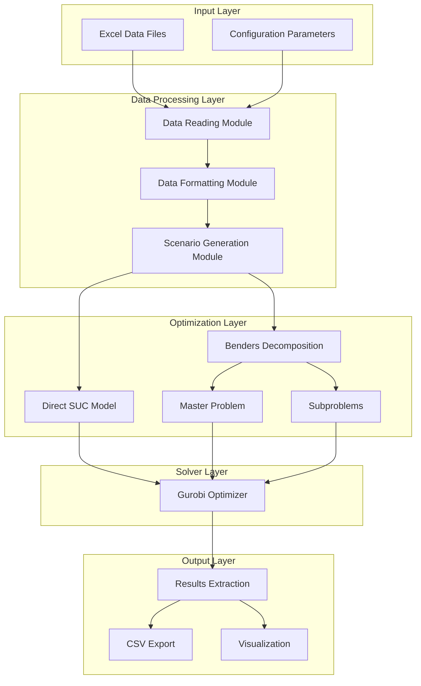
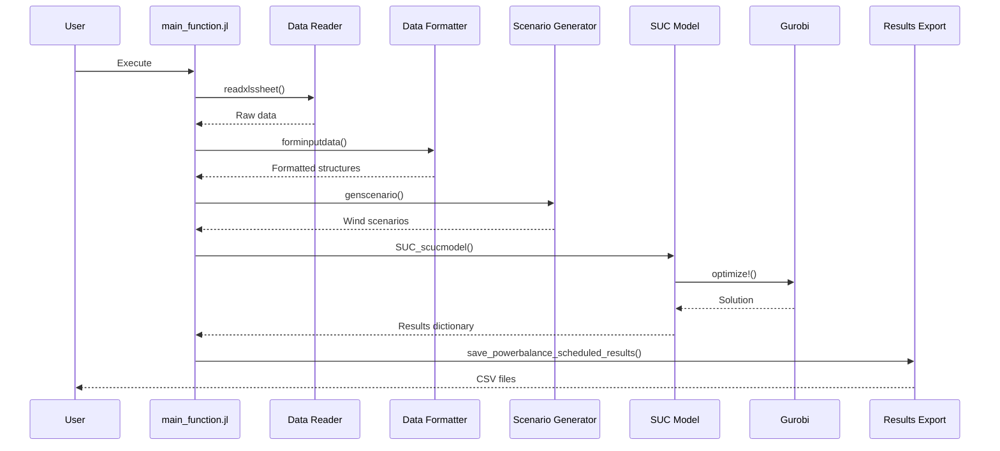
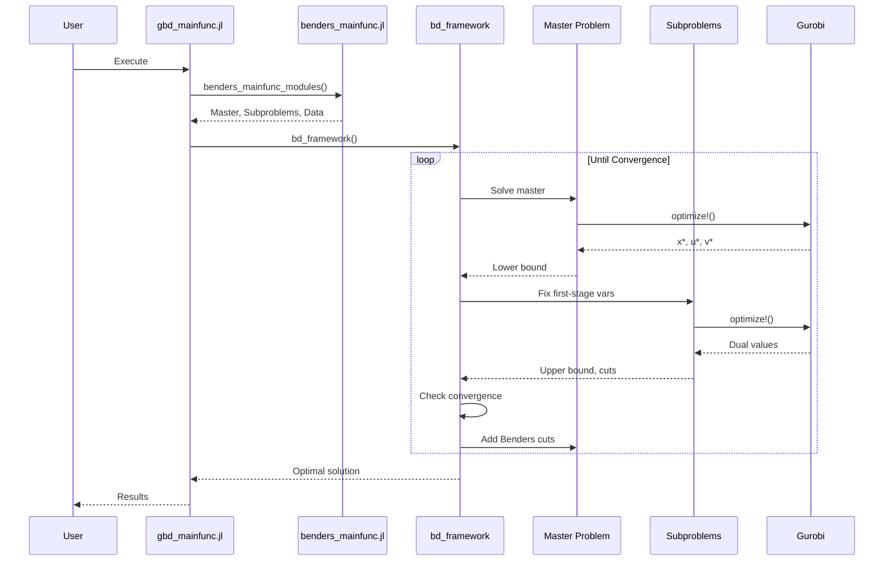

# System Architecture

## Overview

This project implements a **Stochastic Unit Commitment (SUC)** optimization framework for power systems with integrated datacenter operations. The system uses **Benders decomposition** to efficiently solve large-scale two-stage stochastic programming problems.

## High-Level Architecture



## Core Components

### 1. Input Data Management (`src/read_inputdata_modules/`)

**Purpose**: Read, validate, and format input data from Excel files.

**Key Files**:
- [`_readdatafromexcel.jl`](../src/read_inputdata_modules/_readdatafromexcel.jl) - Excel file parsing
- [`_formatteddata.jl`](../src/read_inputdata_modules/_formatteddata.jl) - Data structure formatting
- [`_showboundrycase.jl`](../src/read_inputdata_modules/_showboundrycase.jl) - Boundary condition display
- [`readdatas.jl`](../src/read_inputdata_modules/readdatas.jl) - Main module interface

**Data Types**:
- Generator parameters (capacity, costs, ramp rates, minimum up/down times)
- Network topology (buses, transmission lines, impedances)
- Load profiles (demand curves, datacenter flexibility)
- Renewable resources (wind/solar capacity, frequency parameters)
- Storage systems (BESS capacity, efficiency, charge/discharge rates)
- Hydroelectric units (capacity, water constraints)

### 2. Renewable Energy Simulation (`src/renewableresource_modules/`)

**Purpose**: Generate stochastic scenarios for renewable energy sources.

**Key Files**:
- [`_renewableenergysimulation.jl`](../src/renewableresource_modules/_renewableenergysimulation.jl) - Scenario generation algorithms
- [`stochasticsimulation.jl`](../src/renewableresource_modules/stochasticsimulation.jl) - Main simulation interface

**Capabilities**:
- Wind power scenario generation using statistical distributions
- Solar power uncertainty modeling
- Scenario reduction techniques
- Probability assignment for scenarios

### 3. Unit Commitment Model (`src/unitcommitment_model_modules/`)

**Purpose**: Define and solve the optimization problem using JuMP.

**Key Files**:
- [`SUCuccommitmentmodel.jl`](../src/unitcommitment_model_modules/SUCuccommitmentmodel.jl) - Main model definition

**Sub-modules**:

#### 3.1 Constraints Library (`constraints_lib/`)
- [`_constraint_generator.jl`](../src/unitcommitment_model_modules/constraints_lib/_constraint_generator.jl) - Generator operation constraints
- [`_constraint_systemwide.jl`](../src/unitcommitment_model_modules/constraints_lib/_constraint_systemwide.jl) - System-wide constraints
- [`_constraint_network.jl`](../src/unitcommitment_model_modules/constraints_lib/_constraint_network.jl) - Transmission network constraints
- [`_constraint_storage.jl`](../src/unitcommitment_model_modules/constraints_lib/_constraint_storage.jl) - Energy storage constraints
- [`_constraint_datacentra.jl`](../src/unitcommitment_model_modules/constraints_lib/_constraint_datacentra.jl) - Datacenter flexibility constraints
- [`_constraint_frequencydynamic.jl`](../src/unitcommitment_model_modules/constraints_lib/_constraint_frequencydynamic.jl) - Frequency dynamics constraints

#### 3.2 Objectives Library (`objectives_lib/`)
- [`_objective_econimic.jl`](../src/unitcommitment_model_modules/objectives_lib/_objective_econimic.jl) - Economic objective function

#### 3.3 Utilities Library (`utilitie_modules_lib/`)
- [`_define_decision_variables.jl`](../src/unitcommitment_model_modules/utilitie_modules_lib/_define_decision_variables.jl) - Variable definitions
- [`_linearization.jl`](../src/unitcommitment_model_modules/utilitie_modules_lib/_linearization.jl) - Linearization techniques
- [`_powerflowcalculation.jl`](../src/unitcommitment_model_modules/utilitie_modules_lib/_powerflowcalculation.jl) - DC power flow
- [`_solver_utils.jl`](../src/unitcommitment_model_modules/utilitie_modules_lib/_solver_utils.jl) - Solver interface
- [`_saveschedulingresult.jl`](../src/unitcommitment_model_modules/utilitie_modules_lib/_saveschedulingresult.jl) - Results export

#### 3.4 Testing Library (`tests_lib/`)
- [`_check_validata_input.jl`](../src/unitcommitment_model_modules/tests_lib/_check_validata_input.jl) - Input validation
- [`_check_MIP_prob.jl`](../src/unitcommitment_model_modules/tests_lib/_check_MIP_prob.jl) - MIP problem verification

### 4. Benders Decomposition (`tools/bendersdecomposition/`)

**Purpose**: Implement two-stage stochastic optimization using Benders decomposition.

**Key Files**:
- [`benderdecomposition_module.jl`](../tools/bendersdecomposition/benderdecomposition_module.jl) - Core algorithm
- [`benders_mainfunc.jl`](../tools/bendersdecomposition/benders_mainfunc.jl) - Main entry point
- [`gbd_mainfunc.jl`](../tools/bendersdecomposition/gbd_mainfunc.jl) - Execution script

**Sub-modules**:

#### 4.1 Master/Subproblem Definition (`define_master_sub_problems/`)
- [`_define_batch_subproblems.jl`](../tools/bendersdecomposition/define_master_sub_problems/_define_batch_subproblems.jl) - Batch subproblem generation

#### 4.2 Multi-cut Construction (`construct_multicuts_lib/`)
- [`_get_benders_cumulative_multicuts.jl`](../tools/bendersdecomposition/construct_multicuts_lib/_get_benders_cumulative_multicuts.jl) - Cumulative cuts
- [`_get_benders_eachconstraints_multiplecut.jl`](../tools/bendersdecomposition/construct_multicuts_lib/_get_benders_eachconstraints_multiplecut.jl) - Per-constraint cuts
- [`_get_benders_multi_opti_feas_cuts.jl`](../tools/bendersdecomposition/construct_multicuts_lib/_get_benders_multi_opti_feas_cuts.jl) - Optimality/feasibility cuts
- [`_get_dual_subprob_constrs_coefficients.jl`](../tools/bendersdecomposition/construct_multicuts_lib/_get_dual_subprob_constrs_coefficients.jl) - Dual coefficient extraction

### 5. Visualization (`src/visualization_modules/`)

**Purpose**: Generate plots and visualizations of results.

**Key Files**:
- [`casesploting.jl`](../src/visualization_modules/casesploting.jl) - Case plotting
- [`draw_onlineactivepowerbalance.jl`](../src/visualization_modules/draw_onlineactivepowerbalance.jl) - Power balance visualization
- [`draw_addditionalpower.jl`](../src/visualization_modules/draw_addditionalpower.jl) - Additional power visualization

## Data Flow

### Direct Optimization Mode



### Benders Decomposition Mode



## Key Design Patterns

### 1. Modular Constraint System
Each constraint type is defined in a separate file with a consistent interface:
```julia
function add_<constraint_type>_constraints!(model::Model, params...)
    # Add constraints to model
end
```

### 2. Struct-Based Data Organization
Data is organized into typed structures for type safety and clarity:
- `unit` - Generator data
- `load` - Load data
- `wind` - Wind generation data
- `transmissionline` - Network data
- `config` - Configuration parameters

### 3. Two-Stage Decomposition
- **First Stage**: Unit commitment decisions (binary variables)
- **Second Stage**: Economic dispatch (continuous variables)
- **Coupling**: First-stage decisions constrain second-stage feasibility

### 4. Multi-Cut vs Single-Cut
- **Single-Cut**: One aggregated subproblem per iteration
- **Multi-Cut**: Separate subproblem per scenario (faster convergence)

## Technology Stack

- **Language**: Julia 1.6+
- **Optimization**: JuMP.jl modeling framework
- **Solver**: Gurobi (commercial MILP solver)
- **Data I/O**: XLSX.jl, CSV.jl, DataFrames.jl
- **Visualization**: Plots.jl, PlotlyJS.jl
- **Statistics**: Distributions.jl, MultivariateStats.jl

## Performance Considerations

1. **Linearization**: Non-linear fuel cost curves are linearized using piecewise linear approximation
2. **DC Power Flow**: Simplified linear power flow model for computational efficiency
3. **Scenario Reduction**: Clustering techniques reduce the number of scenarios
4. **Warm Starting**: Initial conditions from previous solutions speed up convergence
5. **Parallel Subproblems**: Independent subproblems can be solved in parallel (future enhancement)

## Extension Points

The architecture supports easy extension:

1. **New Constraint Types**: Add files to `constraints_lib/`
2. **New Objective Terms**: Modify `objectives_lib/`
3. **New Resource Types**: Extend data structures and add constraint modules
4. **Custom Decomposition**: Modify `benderdecomposition_module.jl`
5. **Alternative Solvers**: Change solver in `environment_config.jl`