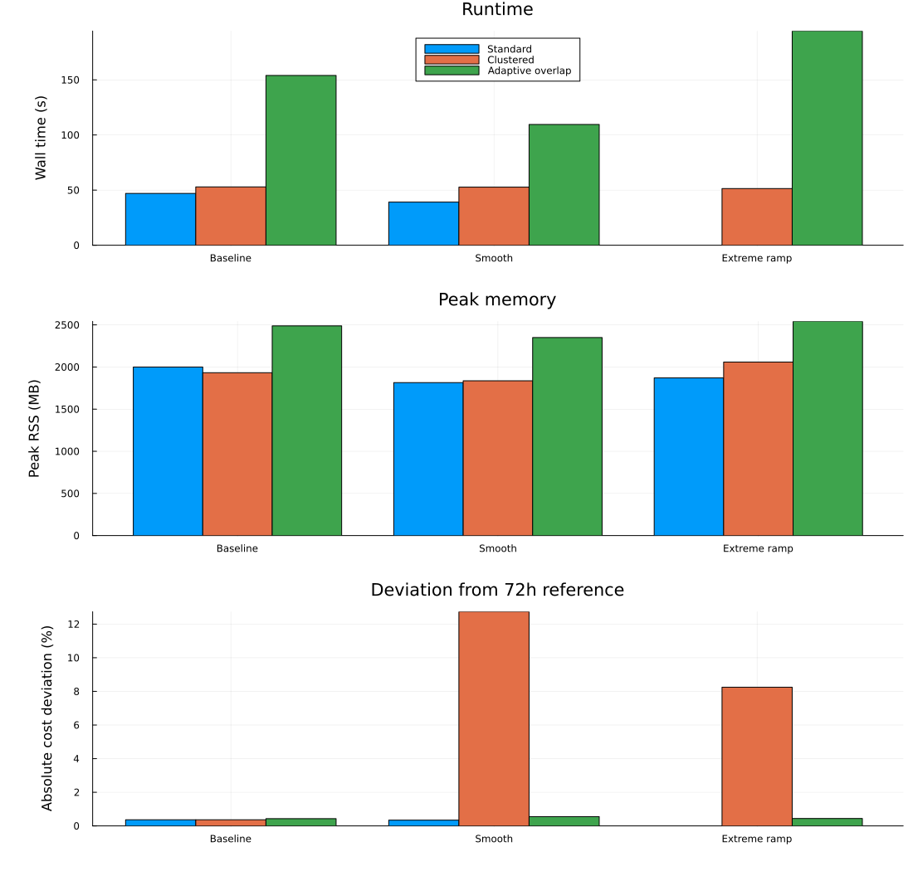

# PCM 三套建模方法性能对比分析报告

## 技术摘要

本报告比较常规单机 PCM（Standard PCM）、同质机组聚类 PCM（Clustered PCM）和自适应交叠窗 PCM（Adaptive Overlap PCM）在原始、平滑和频繁极端爬坡三类等能量负荷曲线下的计算耗时、计算精度与内存占用。

实验结论如下：

1. **正常和较平滑负荷下，常规单机 PCM 是当前最稳妥的默认方案。**它在原始、平滑曲线下分别用时 47.01 s、39.12 s，相对 72 h 整体单机参考解的绝对成本偏差为 0.36%、0.34%，速度和精度均优于另外两套方法。
2. **极端频繁爬坡下，自适应交叠窗的鲁棒性最好。**常规单机 PCM 在第 3 个滚动区间不可行；自适应交叠窗完成全部区间，相对参考解偏差为 0.44%。代价是壁钟时间增至 194.28 s、峰值 RSS 增至 2.54 GB。
3. **当前聚类 PCM 更像“聚类尝试 + 单机回退”的混合流程，而不是稳定的纯聚类求解器。**原始曲线 3/3 区间回退；平滑和极端爬坡各只有 1/3 区间完成纯聚类求解。其平滑、极端场景成本比整体参考解低 12.74%、8.25%，超出合理最优性误差范围，说明聚类结果的跨窗状态可行性或成本核算仍需修正，不能将该低成本解释为精度优势。
4. **当前 `ml_prediction` 分支没有真正响应极端爬坡事件。**三类曲线均选择 `[10, 10, 10]` h 交叠窗，极端曲线也记录为 0 次爬坡事件。自适应方案在极端场景中仍然成功，主要来自固定的额外前瞻长度，而不是事件检测器动态扩大窗口。

因此，现阶段建议：正常运行优先使用常规单机 PCM；存在频繁极端爬坡或滚动边界不可行风险时使用自适应交叠窗；聚类 PCM 暂作为实验性加速层，并保留单机回退，不宜单独承担正式精度结果。

## 关键实验结果

### 正常与平滑负荷下，单机 PCM 同时占优

| 负荷曲线 | 方法 | 状态 | 壁钟时间 (s) | 累计分配 (MB) | 峰值 RSS (MB) | 相对 72 h 参考解绝对偏差 |
|---|---|---:|---:|---:|---:|---:|
| 原始 | 单机 PCM | OK | 47.01 | 18,161.3 | 2,000.0 | 0.36% |
| 原始 | 聚类 PCM | OK（3/3 回退） | 52.91 | 18,607.0 | 1,932.6 | 0.36% |
| 原始 | 自适应交叠窗 | OK | 154.00 | 62,325.4 | 2,488.5 | 0.43% |
| 平滑 | 单机 PCM | OK | 39.12 | 18,169.3 | 1,815.3 | 0.34% |
| 平滑 | 聚类 PCM | OK（1/3 聚类） | 52.71 | 14,137.9 | 1,837.1 | 12.74%* |
| 平滑 | 自适应交叠窗 | OK | 109.56 | 62,333.4 | 2,350.0 | 0.55% |

原始曲线下聚类 PCM 全部回退，因此其成本与单机 PCM 相同，但增加了聚类、驻留流检查和回退开销。平滑曲线下聚类模型减少了累计分配量，但出现异常的负向成本偏差（比整体参考解低 12.74%），不能视为更优解。

### 极端爬坡下，较长前瞻窗提供了关键鲁棒性

| 方法 | 状态 | 壁钟时间 (s) | 峰值 RSS (MB) | 相对 72 h 参考解绝对偏差 | 解释 |
|---|---:|---:|---:|---:|---|
| 单机 PCM | **FAILED** | — | 1,870.9（失败前） | — | 第 3 区间 `INFEASIBLE_OR_UNBOUNDED` |
| 聚类 PCM | OK | 51.39 | 2,059.2 | 8.25%* | 1/3 聚类成功，2/3 回退 |
| 自适应交叠窗 | OK | 194.28 | 2,542.0 | **0.44%** | 全部区间成功，交叠窗均为 10 h |

极端场景说明短窗口单机 PCM 容易在边界状态传递后失去下一窗口可行性。自适应交叠窗通过额外前瞻保持了可行性和接近整体参考解的成本。聚类 PCM 也完成运行，但其成本偏差达到 -8.25%，且主要依赖回退机制，精度结论不可靠。

`*` 聚类 PCM 的大幅负向成本偏差不是“优于整体最优解”的证据，而是跨窗状态、聚合成本或解群结果与整体参考模型尚未完全等价的诊断信号。

## 负荷场景定义

三类曲线均由 `data_118_clustered_pcm.xlsx` 的同一基础曲线生成，保持 72 h 总负荷电量不变，只改变时间分布。

| 场景 | 平均负荷 (MW) | 最大相邻小时爬坡/平均负荷 | 超过平均负荷 15% 的爬坡次数 | 总绝对爬坡量 |
|---|---:|---:|---:|---:|
| 原始 | 79.759 | 59.12% | 25 | 698.92 |
| 平滑 | 79.784 | 20.44% | 8 | 341.41 |
| 极端爬坡 | 79.743 | 146.81% | 33 | 1,280.91 |

平滑曲线采用 5 小时移动平均后重新缩放总电量；极端曲线每 4 小时在 0.70/1.30 倍负荷间切换，并加入确定性尖峰，再缩放回原总电量。

## 指标与实验口径

- **计算范围：**3 个 24 h 滚动区间，共 72 h。
- **输入公平性：**相同机组、风电场景、随机种子 `20260809` 和负荷总电量。
- **网络约束：**三种方案均设置 `PCM_NETWORK_CONSTRAINTS=0`，只比较主体 UC/PCM 逻辑。
- **计算耗时：**独立 Julia 进程内 `@timed` 的完整壁钟时间；包含模型构建、求解、结果导出和首次编译。自适应方法的离线标定未计入，本次使用 `ml_prediction`，标定时间为 0。
- **在线子问题时间：**自适应方案原始、平滑、极端场景分别为 52.43 s、30.13 s、75.30 s；壁钟时间还包含每个区间的本地参考解、数据处理及导出。
- **内存：**`allocated_mb` 是累计 Julia 分配量，不等于同时驻留内存；`peak_rss_mb` 是独立进程峰值驻留集，更适合比较机器容量需求。
- **精度：**以相同场景的 72 h 整体单机 SCUC 为参考，使用七类调度成本之和的绝对相对偏差。参考解状态均为 `OPTIMAL`，相对 MIP gap 分别约为 0、0.265% 和 0.776%。
- **求解器：**Gurobi，滚动子问题目标 MIP gap 为 1.5%。

## 三种方法的性能定位

### 常规单机 PCM：正常场景的首选基线

优势：

- 正常和平滑曲线下耗时最低、成本偏差最小。
- 模型和成本核算链最直接，结果最容易审计。
- 峰值内存约 1.8–2.0 GB，低于自适应交叠窗。

不足：

- 24 h 窗口缺少足够前瞻时，边界状态可能导致后续区间不可行。
- 极端爬坡实验在第 3 区间失败，说明固定窗口缺乏边界鲁棒性。

适用范围：负荷变化可预测、爬坡事件适中、需要稳定快速批量仿真的生产场景。

### 聚类 PCM：尚未兑现稳定加速，需要先修复等价性

优势：

- 理论上可将 108 台物理机组压缩为 54 个虚拟机组，降低整数变量维度。
- 平滑曲线下累计分配量为 14.14 GB，低于单机 PCM 的 18.17 GB。
- 自带驻留流检查和单机回退，因此在极端场景下仍能返回结果。

不足：

- 原始场景 0/3 区间完成纯聚类；平滑和极端场景均只有 1/3。
- 聚类检查、网络反馈/解群和回退开销使其在公平实验中没有获得耗时优势。
- 平滑、极端场景出现 -12.74%、-8.25% 的成本偏差，表明聚类调度、解群后成本和跨窗初始状态之间仍存在不一致。

适用范围：当前仅适合作为带严格回退保护的实验性加速层；在成本一致性与驻留流边界修复前，不建议用于正式精度结论。

### 自适应交叠窗：极端场景最可靠，但计算和内存代价最高

优势：

- 三类场景全部成功，极端爬坡下相对参考解偏差仅 0.44%。
- 额外前瞻能缓解固定窗口边界导致的机组启停和爬坡不可行。
- 成本偏差在三类场景中保持在 0.43%–0.55%，稳定性最好。

不足：

- 壁钟时间是单机 PCM 的约 2.8–3.3 倍（可比较的原始和平滑场景）。
- 累计分配量稳定在约 62.3 GB，约为单机 PCM 的 3.4 倍；峰值 RSS 为 2.35–2.54 GB。
- `ml_prediction` 当前直接返回预测窗口，绕过 `T_steady/T_unit/T_ramp` 综合逻辑；极端曲线仍未触发爬坡事件，窗口固定为 10 h。
- 未找到离线训练数据集，本次使用内置回退决策树，不能代表训练后模型的最终效果。

适用范围：高爬坡、高不确定性、固定窗口容易边界失效，并且可以接受额外算力的安全关键场景。

## 局限性、稳健性与可信度

### 总体评估：可用于工程选型，但聚类精度结论需要修订

以下检查已经完成：九组滚动实验、三组整体参考解、独立进程性能计量、负荷等能量校验、聚类成功/回退日志核对、最终 CSV 重算。

仍需保留以下限制：

1. 每组只运行一个固定随机种子，没有重复试验置信区间；耗时排序可能受求解器启发式和机器负载影响。
2. 壁钟时间包含 Julia 首次编译，但每组使用独立进程，因此横向口径一致。
3. 滚动成本有时低于整体参考解。对于单机/自适应方案偏差不超过 0.55%，可能来自 MIP gap、窗口成本核算和终端条件差异；聚类方案的 8%–13% 偏差过大，属于必须修复的问题。
4. 本实验不含输电网络、储能、数据中心和频率约束，结论只适用于当前主体 PCM 建模范围。
5. 自适应实验使用回退树而非经当前数据重新标定的模型；离线标定时间按要求不计入在线时间。

## 建议的工程路径

1. **默认生产模式使用单机 PCM。**当爬坡指标低于预设阈值且上一窗口边界可行时，它提供当前最好的速度—精度平衡。
2. **增加极端事件触发的交叠窗模式。**不要让 `ml_prediction` 直接提前返回；应采用 `max(T_ml, T_dwell, T_ramp)`，保证事件检测和驻留时间形成安全下界。
3. **修复聚类成本与跨窗状态一致性后再评估加速。**逐项对齐聚类主问题成本、解群后的物理机组成本、启停状态、剩余最小开停机时间和水电边界，并增加“聚类结果重算成本必须与虚拟机组成本一致”的测试。
4. **把回退率作为聚类 PCM 的核心 KPI。**若连续实验回退率高于 10%，聚类层不应默认启用；当前回退率为原始 100%、平滑 66.7%、极端 66.7%。
5. **开展重复与规模敏感性实验。**至少使用 5 个风电种子，扩展到 7 天，并分别测试 12/24/36 h 执行窗和 2–12 h 交叠窗，报告中位耗时、P90、峰值内存和可行率。

## 进一步问题

- 极端曲线下单机 PCM 第 3 区间不可行的直接原因是机组剩余驻留时间、爬坡能力还是水电跨窗状态？
- 聚类成功区间为何产生显著低于整体参考解的核算成本？差异来自启停成本、备用、弃风/切负荷还是解群后的物理出力？
- 重新生成离线训练数据后，ML 预测窗口能否在正常场景缩短至 2–6 h，同时在极端场景提高到 10–12 h？
- 若不使用本地参考解，自适应方案能否保留极端可行性并显著降低 2–3 倍的额外耗时？

## 数据与复现材料

- 汇总指标：`output/pcm_benchmark/20260809_three_method/final_comparison.csv`
- 公平实验原始计量：`output/pcm_benchmark/20260809_three_method/metrics_fair.csv`
- 各场景日志与结果：`output/pcm_benchmark/20260809_three_method/{profile}/{method}/`
- 输入文件：`data/data_118_clustered_pcm.xlsx`
- 负荷变换：`tools/pcm/load_profiles.jl`
- 性能采集器：`tools/pcm/benchmark_method.jl`

报告生成日期：2026-08-09（Asia/Shanghai）。
