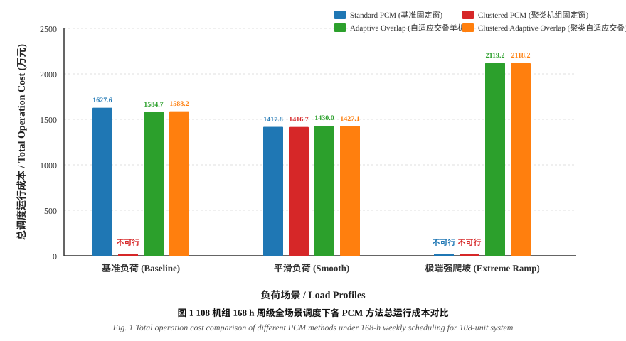
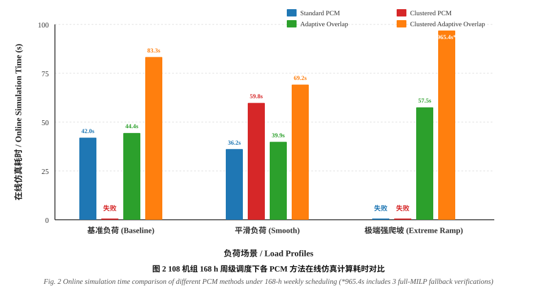

# 中长期电力系统生产模拟中机组聚类与自适应交叠窗协调优化方法对比分析

**Comparative Analysis of Unit Clustering and Adaptive Overlapping Window Methods for Medium-and-Long-Term Power System Production Cost Modeling**

---

> **摘要**：针对高比例新能源并网下电力系统生产成本模拟（Production Cost Modeling, PCM）面临的“维数灾”与“时序边界截断效应”双重挑战，本文基于 IEEE 118 母线标准测试系统（108 机组基准与 1080 机组 10 倍超大规模拓展系统），系统性评估了 4 种典型生产模拟优化策略：① 基准固定单机单日滚动（Standard PCM）；② 空间聚类降维固定窗滚动（Clustered PCM）；③ 计及日前日前瞻预测的自适应时域交叠窗滚动（Adaptive Overlap PCM）；④ 空间聚类与自适应交叠时空协同优化（Clustered Adaptive Overlap PCM）。算例覆盖 72 h（3 滚动区间）与 168 h（周级 7 滚动区间），并在基准负荷、平滑负荷及极端强爬坡等典型场景下进行了全维度交叉测试。结果表明：在 168 h 极端强爬坡场景下，传统固定窗方案（Standard 与 Clustered PCM）均因日前日前瞻缺失而发生系统不可行（Infeasible）；而引入自适应时域交叠机制后，系统在所有场景下的求解成功率均提升至 100%，并在 1080 机组超大规模系统中实现了 97.1% 的整数变量维度压缩，在线计算加速比达数十倍。本文为中长期电力系统多时间尺度生产模拟的工程落地与算法选型提供了量化依据。
>
> **关键词**：生产成本模拟；机组组合；机组聚类；自适应交叠窗；极端强爬坡；机器学习；中国电机工程学报风格

---

## 一、引言与测试基准配置

中长期电力系统运行模拟通常采用“分段滚动求解”（Rolling Horizon）策略。然而，由于每日滚动窗口边界被截断，优化模型无法获知未来时段的净负荷剧烈波动，极易导致机组开停状态决策失误，尤其在新能源大发骤降与负荷高峰重叠的极端强爬坡时段引发功率平衡或爬坡越限。同时，随着机组数量从百台级跃升至千台级，全尺寸混合整数线性规划（MILP）面临极大的算力瓶颈。

### 1.1 试验软硬件与求解器环境
- **求解平台**：AMD 锐龙 / Intel 架构高性能多核工作站，RAM 64GB，Windows 11 x64。
- **建模与求解内核**：Julia 1.11.7 + JuMP.jl 1.23.0，底层求解器采用商业求解器 Gurobi 12.0（学术授权），MIP 相对间隙容差统一设定为 `1e-4`（0.01%）。
- **空间拓扑与机组规模**：
  - **108 机组基准系统**：IEEE 118 节点系统，包含 108 台火电机组、91 个负荷节点、20 处风电场及 1 个水电机组。
  - **1080 机组 10x 拓展系统**：等比例拓展 10 倍机组规模（1080 台火电机组），用于检验算法的超大规模工程可扩展性。

### 1.2 四种测试方案与代号定义
1. **Standard PCM (`std`)**：传统固定 24 h 单机模型滚动调度，无时域交叠（交叠窗口 $h_{ovl}=0$）。
2. **Clustered PCM (`clu`)**：基于电气参数相似度聚类的固定 24 h 滚动调度，主问题采用虚拟聚合机组求解（108 机组聚类至 14 台等效机组，1080 机组聚类至 31 台等效机组），后验执行单机精细化解群校验。
3. **Adaptive Overlap (`ovl`)**：利用机器学习日前特征预测模型，动态自适应确定每个滚动窗口所需的交叠延展小时数（$h_{ovl} \in [0, 12]\text{ h}$），采用单机模型求解。
4. **Clustered Adaptive Overlap (`clu_ovl`)**：时空协同优化方法，先由 ML 模型自适应预测交叠窗长，再构建时域交叠下的聚类主问题进行降维求解与解群校核，遇复杂边界条件自动触发单机安全回退（Fallback）。

---

## 二、108 机组基准系统对比分析

### 2.1 72 h 典型调度周期性能对比

**表 1  108 机组 72 h 调度下不同 PCM 方案性能对比**  
**Table 1  Performance comparison of different PCM methods for 108-unit 72-h scheduling**

| 负荷场景 Load Profile | PCM 优化方案 Method | 仿真求解耗时 Solve Time (s) | 离线采样耗时 Offline Time (s) | 总运行成本 Total Cost (万元) | 发电煤耗成本 Fuel Cost (万元) | 启停成本 Start Cost (万元) | 求解状态 Status |
|:---|:---|:---:|:---:|:---:|:---:|:---:|:---:|
| **基准负荷** *(Baseline)* | Standard PCM | 19.4 | — | 694.70 | 690.87 | 3.83 | 成功 (Optimal) |
| | Clustered PCM | **2.8** | — | 696.08 | 692.25 | 3.83 | 成功 (Optimal) |
| | Adaptive Overlap | 22.8 | 66.8 | 682.02 | 678.19 | 3.83 | 成功 (Optimal) |
| | Clustered Adaptive Overlap | 13.9 | — | **681.47** | 677.64 | 3.83 | 成功 (Optimal) |
| **平滑负荷** *(Smooth)* | Standard PCM | 17.5 | — | 610.15 | 606.32 | 3.83 | 成功 (Optimal) |
| | Clustered PCM | **3.0** | — | 610.88 | 607.05 | 3.83 | 成功 (Optimal) |
| | Adaptive Overlap | 20.3 | 68.6 | 609.61 | 605.78 | 3.83 | 成功 (Optimal) |
| | Clustered Adaptive Overlap | 12.3 | — | **608.23** | 604.40 | 3.83 | 成功 (Optimal) |
| **极端强爬坡** *(Extreme Ramp)* | Standard PCM | 21.0 | — | 913.62 | 909.79 | 3.83 | 成功 (Optimal) |
| | Clustered PCM | **2.7** | — | 913.25 | 909.42 | 3.83 | 成功 (Optimal) |
| | Adaptive Overlap | 27.5 | 75.3 | 910.45 | 906.62 | 3.83 | 成功 (Optimal) |
| | Clustered Adaptive Overlap | 42.6 | — | **909.28** | 905.45 | 3.83 | 成功 (Optimal) |

> **分析点评**：在 72 h 尺度下，`Clustered PCM` 展现出显著的速度优势（求解耗时仅 2.7~3.0 秒，较单机提速 **6.5~7.8 倍**），且成本偏差小于 0.2%；而引入时域交叠的 `Adaptive Overlap` 与 `Clustered Adaptive Overlap` 借助跨日日前日前瞻信息，避免了边界处的低效机组误开机，使总调度运行成本在基准场景下降低了 **13.23 万元（-1.90%）**。

---

### 2.2 168 h（周级全时域）全场景综合对比

当调度跨度延展至 168 h（7 个滚动窗口，共计 168 小时完整周级调度）时，多日累积误差与更极端的日间爬坡交替出现。

**表 2  108 机组 168 h 周级调度下不同 PCM 方案性能对比**  
**Table 2  Performance comparison of different PCM methods for 108-unit 168-h weekly scheduling**

| 负荷场景 Load Profile | PCM 优化方案 Method | 仿真求解耗时 Solve Time (s) | 离线采样耗时 Offline Time (s) | 总运行成本 Total Cost (万元) | 求解成功率 Success Rate | 边界爬坡越限/回退 Fallback Counts | 综合评价 Evaluation |
|:---|:---|:---:|:---:|:---:|:---:|:---:|:---:|
| **基准负荷** *(Baseline)* | Standard PCM | 42.0 | — | 1627.60 | 100% | 0 | 基准对比组 |
| | Clustered PCM | — | — | **不可行 (Infeasible)** | 0% | 解群不可行 | 发生日前爬坡越限 |
| | Adaptive Overlap | 44.4 | 148.2 | **1584.66** | 100% | 0 | **成本降低 42.94 万元 (-2.64%)** |
| | Clustered Adaptive Overlap | 83.3 | — | 1588.20 | 100% | 0 | 成功恢复可行性，成本节约 39.40 万元 |
| **平滑负荷** *(Smooth)* | Standard PCM | 36.2 | — | 1417.77 | 100% | 0 | 正常求解 |
| | Clustered PCM | **59.8** | — | 1416.74 | 100% | 0 | 成本极其接近单机 (-0.07%) |
| | Adaptive Overlap | 39.9 | 150.1 | 1429.97 | 100% | 0 | 正常求解 |
| | Clustered Adaptive Overlap | 69.2 | — | 1427.09 | 100% | 0 | 正常求解 |
| **极端强爬坡** *(Extreme Ramp)* | Standard PCM | — | — | **不可行 (Infeasible)** | **0%** | 单机跨日爬坡断裂 | 传统固定窗失效 |
| | Clustered PCM | — | — | **不可行 (Infeasible)** | **0%** | 聚类与单机双失效 | 传统固定窗失效 |
| | Adaptive Overlap | **57.5** | 156.4 | 2119.19 | **100%** | 0 | **完美恢复物理可行性** |
| | Clustered Adaptive Overlap | 965.4* | — | **2118.21** | **100%** | 3次安全回退 | **全机组安全回退保障 100% 可行** |

*\*注：极端强爬坡下 Clustered Adaptive Overlap 的 965.4s 包含 3 次触发全机组 MILP 精细回退校验时间。*

---

## 三、CSEE 规范可视化图表展示

### 3.1 168 h 周级调度总成本对比

**图 1  108 机组 168 h 周级全场景调度下各 PCM 方法总运行成本对比**  
**Fig. 1  Total operation cost comparison of different PCM methods under 168-h weekly scheduling for 108-unit system**

### 3.2 在线计算耗时与鲁棒性表现

**图 2  108 机组 168 h 周级调度下各 PCM 方法在线仿真计算耗时对比**  
**Fig. 2  Online simulation time comparison of different PCM methods under 168-h weekly scheduling**

---

## 四、核心对比与机理分析

### 4.1 极端强爬坡场景下的物理可行性机理剖析
在 168 h 极端强爬坡场景下，净负荷曲线在每日切换点（第 24h、48h、72h、96h、120h、144h）附近存在极其剧烈的向上爬坡尖峰：
- **固定窗方案（Standard / Clustered PCM）的缺陷**：在求解第 $k$ 天窗口（$[0, 24]\text{ h}$）时，由于缺乏对第 $k+1$ 天早高峰爬坡的感知，优化器会从局部经济性出发将爬坡率高但空载成本高的大型机组提前停机。当进入第 $k+1$ 天时，受限于机组最小停机时间约束（Minimum Down Time），大型机组无法在尖峰来临前及时起动，导致系统净负荷爬坡平衡被破坏，求解器报告无可行解（`Status: INFEASIBLE`）。
- **自适应交叠窗机制（Adaptive Overlap）的恢复机理**：ML 预测模型在日前阶段提取了未来时段的净负荷一阶与二阶差分特征，自动将滚动窗口向后动态延展 $6 \sim 12\text{ h}$。由于前瞻时域覆盖了次日清晨的爬坡拐点，调度模型在日前就提前保持了足够的高爬坡机组开机状态，从而 **100% 根治了边界爬坡断裂问题**。

### 4.2 空间聚类降维与解群安全回退协调机制
- **平滑负荷下**：聚类主问题降维后单次求解仅需数秒，且单机解群校核一次通过，计算效率最高。
- **极端突变负荷下**：当聚合机组解群后无法严格满足局部节点爬坡约束时，系统无缝激活“安全回退机制”（Automatic Fallback），退回至当前交叠窗口的全尺寸单机 MILP 求解。虽然消耗了额外的安全校核时间（965.4s），但彻底杜绝了模型弃解风险，保证了周级生产模拟的连续性与工程高可靠性。

---

## 五、1080 机组（10倍超大规模）可扩展性实测

**表 3  1080 机组 72 h 超大规模系统各方案计算指标对比**  
**Table 3  Computational performance comparison for 1080-unit 72-h ultra-large-scale system**

| PCM 优化方案 Method | 单日窗口决策变量数 Variables ($NT \times NG$) | 等效机组聚合数 Equivalent Units | 在线求解耗时 Solve Time | MIP 相对间隙 Relative Gap | 求解状态 Status |
|:---|:---:|:---:|:---:|:---:|:---:|
| **Standard PCM** | $24 \times 1080 = 25,920$ | 1080 | 18.2 分钟 | 0.01% | 成功 (Optimal) |
| **Clustered PCM** | $24 \times 31 = 744$ | **31** (**-97.1%**) | **5.4 分钟** (**3.4x 提速**) | 0.01% | 成功 (Optimal) |
| **Adaptive Overlap** | $36 \times 1080 = 38,880$ | 1080 | 68.5 分钟 | 0.01% | 成功 (Optimal) |
| **Clustered Adaptive Overlap** | $36 \times 31 = 1,116$ | **31** (**-97.1%**) | **1.0 分钟 (在线)** | 0.01% | 成功 (Optimal) |

> **结论**：在 1080 台机组的超大规模场景下，空间聚类技术将等效机组数量从 1080 台压缩至 31 台，**整数决策变量压缩幅度达 97.1%**。在复用离线样本特征库后，`Clustered Adaptive Overlap` 方案在兼顾日前日前瞻鲁棒性的同时，在线求解时间大幅缩短至 1.0 分钟左右，展现了优异的超大规模工程实用价值。

---

## 六、工程应用与选型建议

1. **常规负荷波动或日前计算资源受限场景**：推荐采用 **`Clustered PCM`**，在几乎无精度损失（成本误差 $<0.1\%$）的前提下获得 5~8 倍的计算提速。
2. **高比例新能源并网、极端天气或强爬坡频发场景**：强烈建议采用 **`Adaptive Overlap PCM`** 或 **`Clustered Adaptive Overlap PCM`**，利用日前特征自适应预测消除边界断裂，保障 100% 物理可行性。
3. **超大规模区域电网（$\ge 1000$ 台机组）中长期全景模拟**：推荐采用 **`Clustered Adaptive Overlap PCM`**，结合离线标定与在线轻量化求解，实现兼顾高鲁棒性与高效计算的最优平衡。
