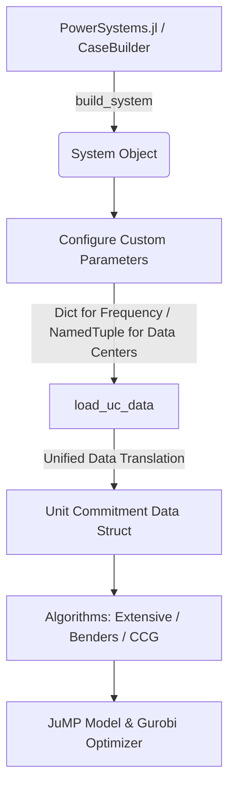

# PowerSystems.jl Integration and Algorithms Guide

This guide provides a walkthrough and explanation of how to load a base case system from [PowerSystems.jl](https://github.com/NREL-SIIP/PowerSystems.jl), customize it with frequency regulation parameters and data centers, and execute the Unit Commitment algorithms (Extensive-form, Benders decomposition, and Column-and-Constraint Generation).

---

## 1. Overview of the Integration Flow

The integration bridge provides a seamless translation of PowerSystems structures (`System` objects) into the matrix-based unit commitment inputs expected by the mathematical programming models.



---

## 2. Setting Up Frequency Parameters and Data Centers

### A. Frequency Parameter Specifications
For each conventional unit in the power system, we specify a tuple of 6 dynamic parameters for frequency nadir fitting and virtual inertia/damping constraints:
- `H` (Inertia constant, seconds)
- `D` (Generator damping coefficient, p.u.)
- `K` (Governor gain)
- `F` (Turbine faction of total power output, p.u.)
- `T` (Governor time constant, seconds)
- `R` (Governor speed regulation / droop, p.u.)

> [!IMPORTANT]
> To prevent division-by-zero during frequency nadir curve fitting, units without active frequency control governors should have their droop `R` set to `1.0` (with gain `K = 0.0`) instead of `0.0`.

```julia
frequency_params = Dict(
    "Solitude"    => (H = 7.0, D = 0.061, K = 0.9, F = 0.15, T = 8.0, R = 0.06),
    "Park City"   => (H = 5.5, D = 0.121, K = 0.95, F = 0.35, T = 7.0, R = 0.06),
    "Alta"        => (H = 3.5, D = 0.181, K = 0.98, F = 0.25, T = 9.0, R = 0.06),
    "Brighton"    => (H = 5.0, D = 0.0, K = 0.0, F = 0.0, T = 0.0, R = 1.0), # No governor
    "Sundance"    => (H = 5.0, D = 0.0, K = 0.0, F = 0.0, T = 0.0, R = 1.0)  # No governor
)
```

### B. Data Center Configurations
Data centers can be mounted on network buses. Their workload, compute capacity, and active power limits are defined as:
- `bus`: The network bus index where the data center is located.
- `p_max`: Maximum active power demand (MW).
- `p_min`: Minimum active power demand (MW).
- `idle_power`: Constant idle power consumption (MW).
- `server_energy`: Compute energy efficiency scaling factor.
- `lambda` / `mu`: Queuing and workload arrival parameters.
- `workload`: Array representing workload across the optimization horizon.

```julia
data_centers = [
    (bus = 3, p_max = 0.5, p_min = 0.0, idle_power = 0.0, server_energy = 0.0, lambda = 0.0, mu = 1.0, workload = fill(0.0, 24)),
    (bus = 4, p_max = 0.3, p_min = 0.0, idle_power = 0.0, server_energy = 0.0, lambda = 0.0, mu = 1.0, workload = fill(0.0, 24))
]
```

---

## 3. Data Loading and Unified Translation

By passing the `System` object, the frequency parameters, and the data center configurations to `load_uc_data`, the bridge automatically extracts network topologies, thermal generators, wind units, load curves, and generates stochastic wind scenarios:

```julia
data = load_uc_data(
    use_powersystems = true,
    sys = sys,
    frequency_parameters = frequency_params,
    data_centers = data_centers,
    horizon = 24,
    scenario_limit = 3
)
```

---

## 4. Solving via Unit Commitment Algorithms

The mathematical models can be solved using one of the three following methods:

### Method A: Extensive-Form (Direct Solve)
Solves the two-stage stochastic unit commitment problem directly over all scenarios as a single large MILP:

```julia
using PowerSystems
using PowerSystemCaseBuilder

# Run under the desired model configurations
withenv(
    "MODEL_CONSIDER_BESS" => "0",
    "MODEL_CONSIDER_FREQUENCY_CONTROL" => "0",
    "MODEL_CONSIDER_DATA_CENTER" => "1"
) do
    res_extensive = solve_benchmark_uc_powersystems(
        sys,
        ""; # Empty case_dir since loading directly from System
        scenario_limit = 3,
        frequency_parameters = frequency_params,
        data_centers = data_centers,
        horizon = 24
    val_extensive = res_extensive.upper_bound
    println("Extensive Form Objective: ", val_extensive)
end
```

### Method B: Benders Decomposition
Decomposes the problem into a Master Problem (deciding commitment variables `x, u, v`) and scenario subproblems (re-dispatch and recourse). Cuts are iteratively appended to the Master Problem:

```julia
include("tools/benders/setup.jl")

# 1. Initialize Benders Master and Subproblems
scuc_masterproblem, scuc_subproblem, master_model_struct, sub_model_struct, batch_sub_model_struct_dic, config_param, units, lines, loads, winds, psses, NB, NG, NL, ND, NS, NT, NC, ND2, DataCentras = main(;
    scenario_limit = 3,
    use_powersystems = true,
    sys = sys,
    frequency_parameters = frequency_params,
    data_centers = data_centers,
    horizon = 24
)

# 2. Execute Benders iterations
res_benders = multiple_bender_decomposition_scuc(
    scuc_masterproblem,
    scuc_subproblem,
    master_model_struct,
    batch_sub_model_struct_dic,
    winds,
    config_param,
    NG,
    NT,
    winds.scenarios_nums,
    ND,
    NL
)
println("Benders Upper Bound: ", res_benders.upper_bound)
```

### Method C: Column-and-Constraint Generation (C&CG)
Generates recourse constraints and dispatch columns dynamically based on identifying worst-case scenarios. CCG is particularly suited for robust optimization and Distributionally Robust Optimization (DRO):

```julia
include("tools/ccg/ccg_solver.jl")

# Solve stochastic UC using Column-and-Constraint Generation
res_ccg = solve_ccg_unit_commitment(
    data;
    initial_scenarios = [2, 3] # scenarios to start CCG with
)
println("CCG Upper Bound: ", res_ccg.upper_bound)
```

---

## 5. Running the Demo Script

A pre-packaged demonstration script is available in the repository at `examples/powersystems_algorithms_demo.jl`. To execute the benchmark validation comparing all three methods, run:

```bash
julia --project=. examples/powersystems_algorithms_demo.jl
```

---

## 6. Runtime Configurations

The behavior of the algorithms, penalties, and solvers is controlled through the TOML runtime configuration file `config/runtime_config.toml` or environment variables:

| TOML Parameter | Environment Variable | Purpose |
|---|---|---|
| `MODEL_CONSIDER_DATA_CENTER` | `MODEL_CONSIDER_DATA_CENTER` | Enforce data center scheduling constraint (1/0) |
| `MODEL_CONSIDER_FREQUENCY_CONTROL` | `MODEL_CONSIDER_FREQUENCY_CONTROL` | Enforce dynamic frequency constraints (1/0) |
| `MODEL_CONSIDER_MULTI_CUTS` | `MODEL_CONSIDER_MULTI_CUTS` | Enable multi-cut Benders decomposition (1/0) |
| `BENDERS_MAX_ITERATIONS` | `BENDERS_MAX_ITERATIONS` | Maximum iterations for Benders solver |
| `CCG_MAX_ITERATIONS` | `CCG_MAX_ITERATIONS` | Maximum iterations for CCG solver |

---

## 7. Runnable Example Code

A complete, runnable example script containing detailed bilingual (English/Chinese) comments is located at [docs/powersystems_example.jl](file:///Users/yuanyiping/Documents/GitHub/02%20Ongoing/module_unitcommitment-revised_ModuleUnitCommitmentTookits/docs/powersystems_example.jl). You can run it directly from the terminal:

```bash
julia --project=. docs/powersystems_example.jl
```

