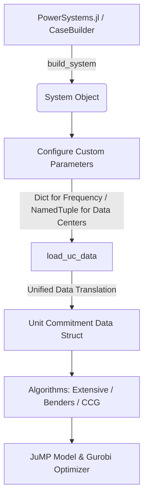

# PowerSystems.jl Integration and Algorithms Guide

This guide provides a walkthrough and explanation of how to load a base case system from [PowerSystems.jl](https://github.com/NREL-SIIP/PowerSystems.jl), customize it with frequency regulation parameters and data centers, and execute the Unit Commitment algorithms (Extensive-form, Benders decomposition, and Column-and-Constraint Generation).

---

## 1. Overview of the Integration Flow

The integration bridge provides a seamless translation of PowerSystems structures (`System` objects) into the matrix-based unit commitment inputs expected by the mathematical programming models.



---

## 2. Setting Up Frequency Parameters and Data Centers

### A. Frequency Parameter Specifications
For each conventional unit in the power system, we specify a tuple of 6 dynamic parameters for frequency nadir fitting and virtual inertia/damping constraints:
- `H` (Inertia constant, seconds)
- `D` (Generator damping coefficient, p.u.)
- `K` (Governor gain)
- `F` (Turbine faction of total power output, p.u.)
- `T` (Governor time constant, seconds)
- `R` (Governor speed regulation / droop, p.u.)

> [!IMPORTANT]
> To prevent division-by-zero during frequency nadir curve fitting, units without active frequency control governors should have their droop `R` set to `1.0` (with gain `K = 0.0`) instead of `0.0`.

```julia
frequency_params = Dict(
    "Solitude"    => (H = 7.0, D = 0.061, K = 0.9, F = 0.15, T = 8.0, R = 0.06),
    "Park City"   => (H = 5.5, D = 0.121, K = 0.95, F = 0.35, T = 7.0, R = 0.06),
    "Alta"        => (H = 3.5, D = 0.181, K = 0.98, F = 0.25, T = 9.0, R = 0.06),
    "Brighton"    => (H = 5.0, D = 0.0, K = 0.0, F = 0.0, T = 0.0, R = 1.0), # No governor
    "Sundance"    => (H = 5.0, D = 0.0, K = 0.0, F = 0.0, T = 0.0, R = 1.0)  # No governor
)
```

### B. Modular Parameter Generation for Large Scale Systems
For large test networks (e.g., IEEE 118-bus or 300-bus systems) with dozens of generators, manually writing parameter dictionaries is impractical. 

The toolkit provides a modular helper function `generate_frequency_parameters` which automatically constructs a complete parameters dictionary for all conventional generators in the `System` based on their **fuel type** and **name prefix heuristics**:

```julia
# Automatically generate baseline parameters for all units in a large system
# 自动为大规模系统中的所有发电机组生成调频参数字典
frequency_params = generate_frequency_parameters(sys)

# Optional: Apply specific manual overrides for key generators
# 用户可提供特定关键机组的自定义参数覆盖
custom_overrides = Dict(
    "Gen-Coal-1" => (H = 6.5, D = 0.08, K = 0.95, F = 0.3, T = 7.0, R = 0.05),
    "Gen-Nuclear-3" => (H = 8.0, D = 0.10, K = 0.0, F = 0.0, T = 0.0, R = 1.0)
)
frequency_params = generate_frequency_parameters(sys; overrides = custom_overrides)
```

The underlying templates used by the generator are physically categorized as follows:
- **Coal / Steam Turbine (`:coal`)**: $H = 6.0, D = 0.08, K = 0.95, F = 0.30, T = 7.0, R = 0.05$
- **Gas Turbine (`:gas`)**: $H = 4.0, D = 0.05, K = 0.90, F = 0.15, T = 5.0, R = 0.04$
- **Hydro (`:hydro`)**: $H = 3.0, D = 0.10, K = 1.00, F = 0.50, T = 4.0, R = 0.05$
- **Nuclear (`:nuclear`)**: $H = 7.0, D = 0.10, K = 0.00, F = 0.00, T = 0.0, R = 1.00$ (No primary response)
- **Others / Default (`:default`)**: $H = 5.0, D = 0.00, K = 0.00, F = 0.00, T = 0.0, R = 1.00$ (No governor)

### C. Data Center Configurations
Data centers can be mounted on network buses. Their workload, compute capacity, and active power limits are defined as:
- `bus`: The network bus index where the data center is located.
- `p_max`: Maximum active power demand (MW).
- `p_min`: Minimum active power demand (MW).
- `idle_power`: Constant idle power consumption (MW).
- `server_energy`: Compute energy efficiency scaling factor.
- `lambda` / `mu`: Queuing and workload arrival parameters.
- `workload`: Array representing workload across the optimization horizon.

```julia
data_centers = [
    (bus = 3, p_max = 0.5, p_min = 0.0, idle_power = 0.0, server_energy = 0.0, lambda = 0.0, mu = 1.0, workload = fill(0.0, 24)),
    (bus = 4, p_max = 0.3, p_min = 0.0, idle_power = 0.0, server_energy = 0.0, lambda = 0.0, mu = 1.0, workload = fill(0.0, 24))
]
```

PowerSystems components themselves use the system-base per-unit convention. When constructing a
component manually, convert MW values by `system_base` before passing them to PowerSystems, for
example `max_active_power = 50.0 / 100.0` for a 50 MW load on a 100 MVA system base. The bridge
passes native generator, load, storage, renewable, and branch values through without dividing by
the base a second time; the data-center extension above remains in MW and is converted by the
toolkit. For MATPOWER cases where a generator has `active_power_limits.max == 0` but a
positive native rating, the bridge uses that rating as the UC `p_max`; an explicitly positive
active-power limit remains unchanged.

---

## 3. Data Loading and Unified Translation

By passing the `System` object, the frequency parameters, and the data center configurations to `load_uc_data`, the bridge automatically extracts network topologies, thermal generators, wind units, load curves, and generates stochastic wind scenarios:

```julia
data = load_uc_data(
    use_powersystems = true,
    sys = sys,
    frequency_parameters = frequency_params,
    data_centers = data_centers,
    horizon = 24,
    scenario_limit = 3
)
```

### 3.1 Curated case catalog and IEEE aliases

The unified bridge exposes a small, stable catalog so application code does not need to
remember the version-specific `PowerSystemCaseBuilder` category and case-name combination:

```julia
using ModuleUnitCommitmentToolkit

for case in list_powersystems_cases()
    println(case.alias, " -> ", case.case_name, ": ", case.description)
end

sys6 = build_system_from_powersystems(:ieee6)
sys30 = build_system_from_powersystems(:ieee30)
sys118 = build_system_from_powersystems(:ieee118)

data118 = load_uc_data(
    input = :powersystems,
    case_name = :ieee118,
    scenario_limit = 1,
    horizon = 24,
)
```

The currently supported curated aliases are:

| Alias | Canonical case | Typical use |
|---|---|---|
| `:ieee6` | `matpower_case6_sys` | smoke tests and fast interface checks |
| `:ieee14` | `matpower_case14_sys` | small network topology experiments |
| `:ieee24` | `matpower_case24_sys` | medium network tests |
| `:ieee30` | `matpower_case30_sys` | IEEE 30-bus algorithm comparisons |
| `:ieee118` | PowerSystemsTestData `118-Bus` artifact | large topology and scaling tests |
| `:c_sys5_all_components` | `PSITestSystems` case | renewable/storage/data-center bridge tests |
| `:rts_gmlc` | `matpower_RTS_GMLC_sys` | realistic RTS-style studies |
| `:activsg2000` / `:activsg10k` | ACTIVSg MATPOWER cases | large-scale stress tests |

The 118-bus alias is backed by the `PowerSystemsTestData` artifact included by the installed
`PowerSystemCaseBuilder` version. It is intentionally registered by this toolkit because that
case is not present in the builder's default public catalog. The adapter normalizes its bus IDs,
thermal units, AC branches, and regional loads into the same internal structures as the smaller
MATPOWER cases. If an exact external IEEE-118 MATPOWER file is required, pass its path instead:

```julia
sys118_external = build_system_from_powersystems("/path/to/case118.m")
data118_external = load_uc_data(
    input = :powersystems,
    sys = sys118_external,
    scenario_limit = 1,
    horizon = 24,
)
```

The unified builder also keeps `PowerSystemCaseBuilder`'s raw deserialization diagnostics out of
the application-level output. In particular, rating-range messages from MATPOWER input are not
printed by `build_system_from_powersystems`; they are diagnostics from the lower-level reader and
do not change the returned `System`. Construction errors still propagate normally. Call
`PowerSystemCaseBuilder.build_system(...)` directly when those raw diagnostics are needed.

For larger cases, start with `scenario_limit = 1`, `verbosity = :summary` or `:silent`, and
frequency control disabled unless the study explicitly requires it. The three algorithms share
this same case/data entry point; only `algorithm = :benchmark`, `:benders`, or `:ccg` changes.

---

## 4. Solving via Unit Commitment Algorithms

The mathematical models can be solved using one of the three following methods:

### Method A: Extensive-Form (Direct Solve)
Solves the two-stage stochastic unit commitment problem directly over all scenarios as a single large MILP:

```julia
using PowerSystems
using PowerSystemCaseBuilder

# Run under the desired model configurations
withenv(
    "MODEL_CONSIDER_BESS" => "0",
    "MODEL_CONSIDER_FREQUENCY_CONTROL" => "0",
    "MODEL_CONSIDER_DATA_CENTER" => "1"
) do
    res_extensive = solve_benchmark_uc_powersystems(
        sys,
        ""; # Empty case_dir since loading directly from System
        scenario_limit = 3,
        frequency_parameters = frequency_params,
        data_centers = data_centers,
        horizon = 24,
    )
    val_extensive = res_extensive.upper_bound
    println("Extensive Form Objective: ", val_extensive)
end
```

### Method B: Benders Decomposition
Decomposes the problem into a Master Problem (deciding commitment variables `x, u, v`) and scenario subproblems (re-dispatch and recourse). Cuts are iteratively appended to the Master Problem:

```julia
include("tools/benders/setup.jl")

# 1. Initialize Benders Master and Subproblems
setup = main(;
    scenario_limit = 3,
    use_powersystems = true,
    sys = sys,
    frequency_parameters = frequency_params,
    data_centers = data_centers,
    horizon = 24
)

scuc_masterproblem = setup.master_model
scuc_subproblem = setup.sub_model
master_model_struct = setup.master_struct
batch_sub_model_struct_dic = setup.batch_subproblems
config_param, units, loads, winds = setup.config_param, setup.units, setup.loads, setup.winds
NG, NT, ND, NL = setup.NG, setup.NT, setup.ND, setup.NL

# 2. Execute Benders iterations
res_benders = multiple_bender_decomposition_scuc(
    scuc_masterproblem,
    scuc_subproblem,
    master_model_struct,
    batch_sub_model_struct_dic,
    winds,
    config_param,
    NG,
    NT,
    length(winds.index),
    ND,
    NL
)
println("Benders Upper Bound: ", res_benders.upper_bound)
```

### Method C: Column-and-Constraint Generation (C&CG)
Generates recourse constraints and dispatch columns dynamically based on identifying worst-case scenarios. CCG is particularly suited for robust optimization and Distributionally Robust Optimization (DRO):

```julia
include("tools/ccg/ccg_solver.jl")

# Solve stochastic UC using Column-and-Constraint Generation. The solver
# accepts input-selection keywords; it does not take the `load_uc_data` result
# as a positional argument.
res_ccg = solve_ccg_unit_commitment(
    scenario_limit = 3,
    use_powersystems = true,
    sys = sys,
    frequency_parameters = frequency_params,
    data_centers = data_centers,
    horizon = 24,
)
println("CCG Upper Bound: ", res_ccg.upper_bound)
```

---

## 5. Running the Demo Script

A unified public-API demonstration script is available at `examples/unified_api/04_powersystems_native.jl`. To run it with the default CCG route, use:

```bash
julia --project=. examples/unified_api/04_powersystems_native.jl
```

Set `UC_ALGORITHM=benchmark` or `UC_ALGORITHM=benders` to select another algorithm. The
older low-level comparative program remains available at `examples/powersystems_algorithms_demo.jl`
for debugging the individual formulation modules.

---

## 6. Runtime Configurations

The behavior of the algorithms, penalties, and solvers is controlled through the TOML runtime configuration file `config/runtime_config.toml` or environment variables:

| TOML Parameter | Environment Variable | Purpose |
|---|---|---|
| `MODEL_CONSIDER_DATA_CENTER` | `MODEL_CONSIDER_DATA_CENTER` | Enforce data center scheduling constraint (1/0) |
| `MODEL_CONSIDER_FREQUENCY_CONTROL` | `MODEL_CONSIDER_FREQUENCY_CONTROL` | Enforce dynamic frequency constraints (1/0) |
| `MODEL_CONSIDER_MULTI_CUTS` | `MODEL_CONSIDER_MULTI_CUTS` | Enable multi-cut Benders decomposition (1/0) |
| `BENDERS_MAX_ITERATIONS` | `BENDERS_MAX_ITERATIONS` | Maximum iterations for Benders solver |
| `CCG_MAX_ITERATIONS` | `CCG_MAX_ITERATIONS` | Maximum iterations for CCG solver |

---

## 7. Runnable Example Code

A complete, runnable example script containing detailed bilingual (English/Chinese) comments is located at [docs/powersystems_example.jl](file:///Users/yuanyiping/Documents/GitHub/02%20Ongoing/module_unitcommitment-revised_ModuleUnitCommitmentTookits/docs/powersystems_example.jl). You can run it directly from the terminal:

```bash
julia --project=. docs/powersystems_example.jl
```
