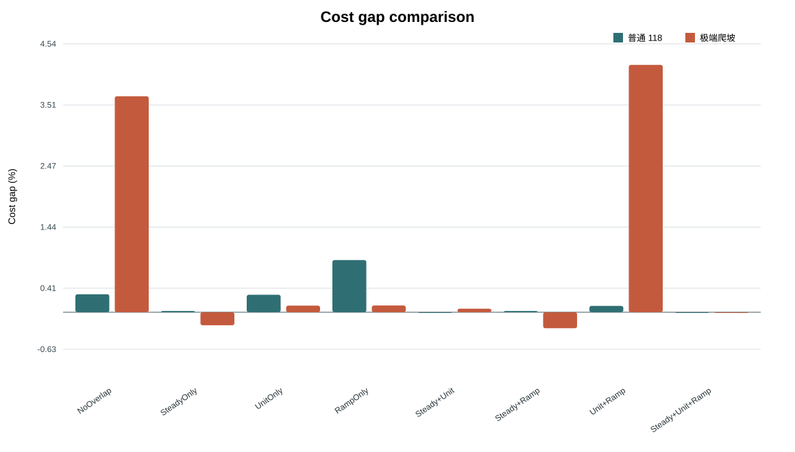
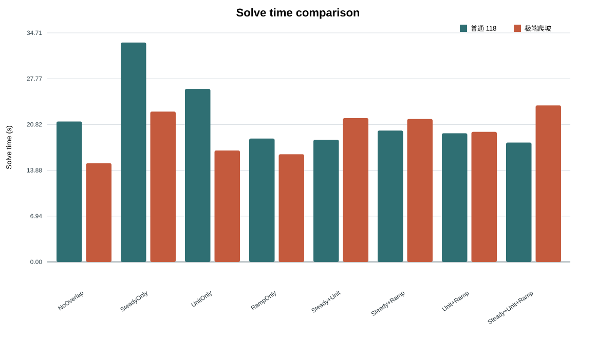
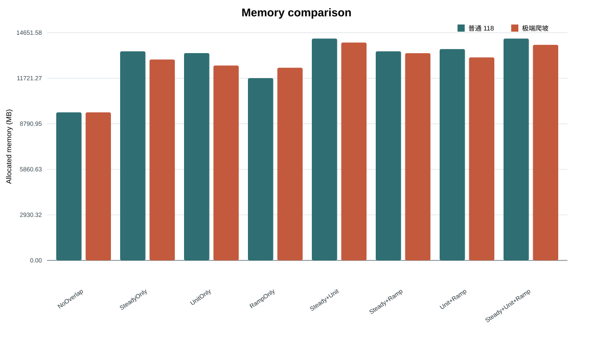
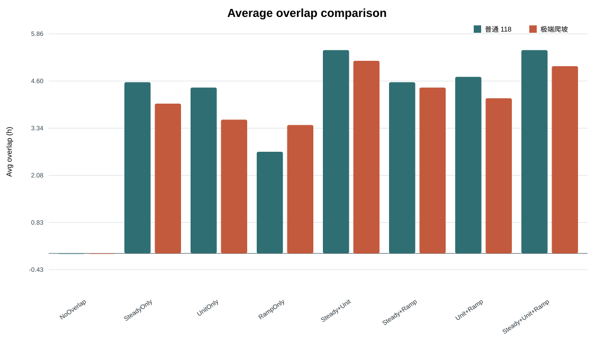

# Ordinary IEEE-118 vs Extreme-Ramp Overlap Criteria Comparison

- Archive batch: `D:\GithubClonefiles\module_unitcommitment\output\archive\pcm_118_normal_vs_extreme_20260808_194121`
- Generated: `2026-08-08 19:56:28`
- Operational solve time uses `SubproblemSolveTime_sec`; offline training/calibration and local reference solves are retained as excluded fields.

## Consolidated Performance

| Scenario | Mode | Cost USD | Gap vs All % | Solve s | Memory MB | Avg overlap h | Load shedding | Wind curtailment |
|---|---|---:|---:|---:|---:|---:|---:|---:|
| ieee118_extreme_ramp | NoOverlap | 15130848.64 | 3.6549 | 14.96 | 9525.54 | 0.00 | 41.04 | 6.50 |
| ieee118_extreme_ramp | SteadyOnly | 14565135.65 | -0.2205 | 22.78 | 12926.46 | 4.00 | 40.53 | 3.19 |
| ieee118_extreme_ramp | UnitOnly | 14613636.31 | 0.1117 | 16.89 | 12539.05 | 3.57 | 40.68 | 5.31 |
| ieee118_extreme_ramp | RampOnly | 14613970.99 | 0.1140 | 16.32 | 12395.44 | 3.43 | 40.65 | 3.98 |
| ieee118_extreme_ramp | Steady+Unit | 14606107.94 | 0.0602 | 21.80 | 14016.98 | 5.14 | 40.56 | 2.30 |
| ieee118_extreme_ramp | Steady+Ramp | 14557878.75 | -0.2702 | 21.66 | 13333.98 | 4.43 | 40.56 | 2.60 |
| ieee118_extreme_ramp | Unit+Ramp | 15208243.19 | 4.1851 | 19.71 | 13060.59 | 4.14 | 40.53 | 7.90 |
| ieee118_extreme_ramp | Steady+Unit+Ramp | 14597325.14 | 0.0000 | 23.72 | 13870.34 | 5.00 | 40.56 | 2.30 |
| ieee118_normal | NoOverlap | 14035802.80 | 0.3045 | 21.28 | 9525.51 | 0.00 | 6.46 | 1.50 |
| ieee118_normal | SteadyOnly | 13996181.38 | 0.0214 | 33.25 | 13453.17 | 4.57 | 6.46 | 0.57 |
| ieee118_normal | UnitOnly | 14034537.60 | 0.2955 | 26.22 | 13337.89 | 4.43 | 6.46 | 1.64 |
| ieee118_normal | RampOnly | 14116742.10 | 0.8830 | 18.70 | 11728.83 | 2.71 | 6.46 | 0.00 |
| ieee118_normal | Steady+Unit | 13993187.42 | 0.0000 | 18.51 | 14271.88 | 5.43 | 6.55 | 0.41 |
| ieee118_normal | Steady+Ramp | 13996181.38 | 0.0214 | 19.90 | 13453.15 | 4.57 | 6.46 | 0.57 |
| ieee118_normal | Unit+Ramp | 14008181.95 | 0.1072 | 19.50 | 13597.07 | 4.71 | 6.46 | 1.84 |
| ieee118_normal | Steady+Unit+Ramp | 13993187.42 | 0.0000 | 18.09 | 14271.88 | 5.43 | 6.55 | 0.41 |

## Cross-Scenario Charts

## Detailed Files

- `criteria_comparison_all_scenarios.csv`
- `extreme_vs_normal_delta.csv`
