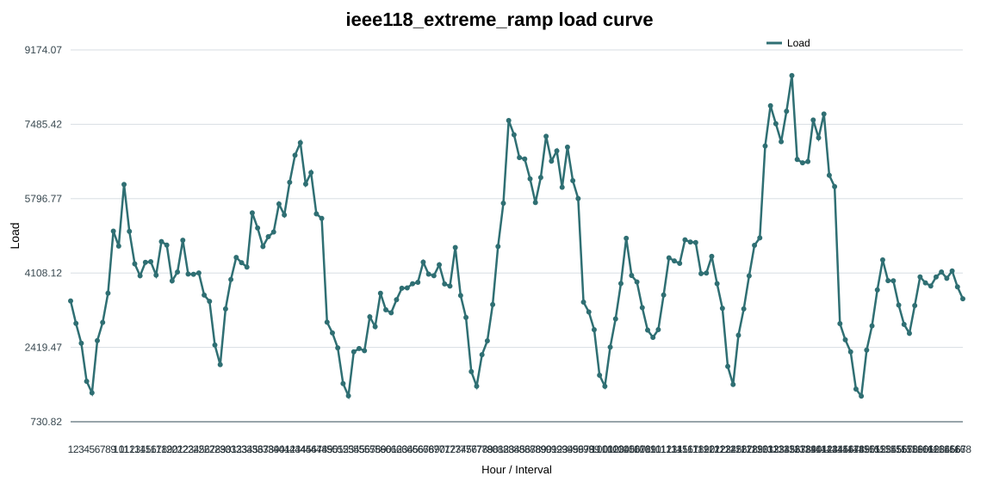
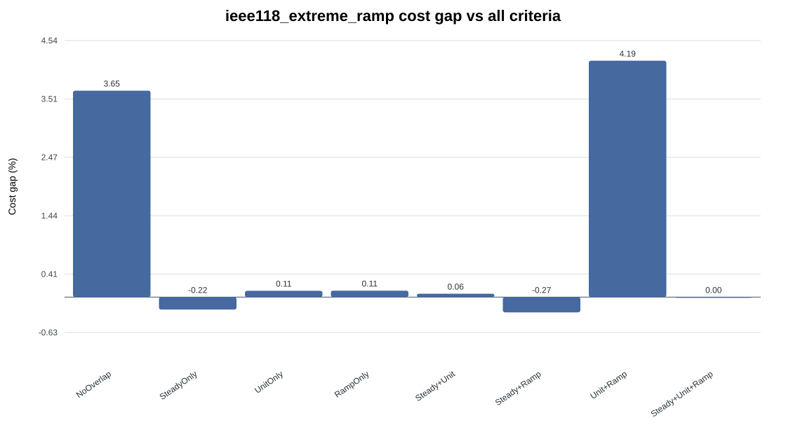
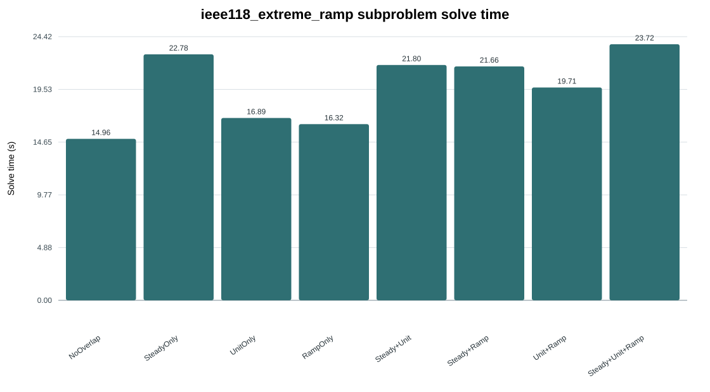
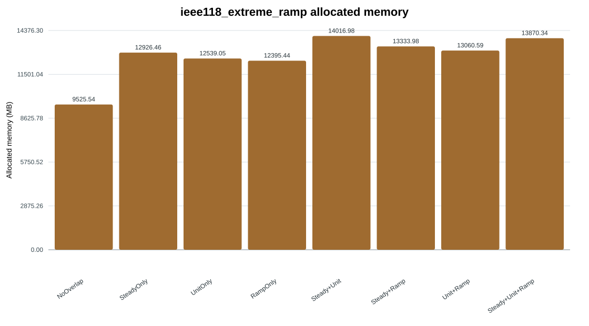
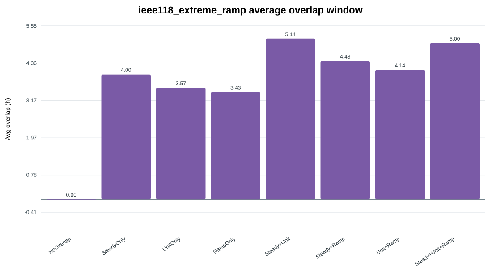
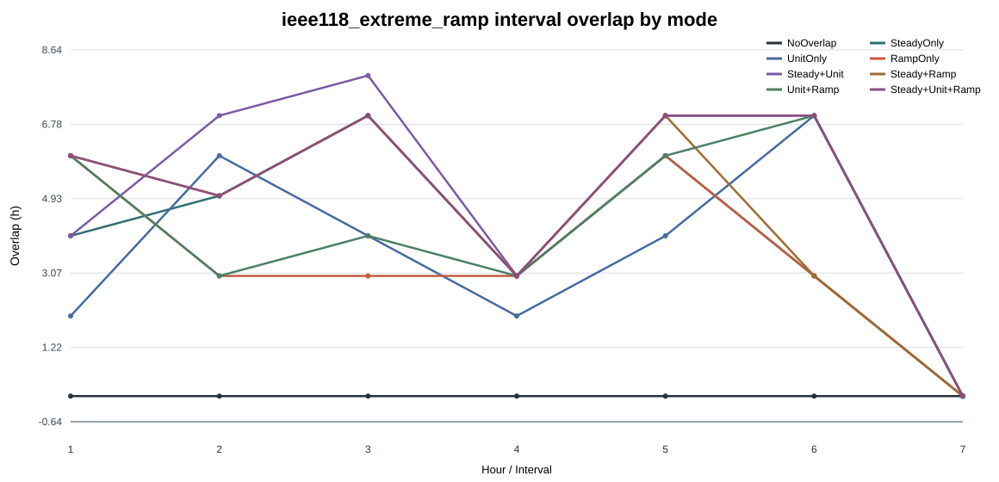

# Criteria Combination Detailed Report

- Scenario: `ieee118_extreme_ramp`
- Generated: `2026-08-08 19:56:27`
- Training/calibration time is reported separately and excluded from operational simulation solve time.

## Performance Table

| Mode | Cost USD | Gap vs All % | Solve s | Memory MB | Avg overlap h | Load shedding | Wind curtailment |
|---|---:|---:|---:|---:|---:|---:|---:|
| NoOverlap | 15130848.64 | 3.6549 | 14.96 | 9525.54 | 0.00 | 41.04 | 6.50 |
| SteadyOnly | 14565135.65 | -0.2205 | 22.78 | 12926.46 | 4.00 | 40.53 | 3.19 |
| UnitOnly | 14613636.31 | 0.1117 | 16.89 | 12539.05 | 3.57 | 40.68 | 5.31 |
| RampOnly | 14613970.99 | 0.1140 | 16.32 | 12395.44 | 3.43 | 40.65 | 3.98 |
| Steady+Unit | 14606107.94 | 0.0602 | 21.80 | 14016.98 | 5.14 | 40.56 | 2.30 |
| Steady+Ramp | 14557878.75 | -0.2702 | 21.66 | 13333.98 | 4.43 | 40.56 | 2.60 |
| Unit+Ramp | 15208243.19 | 4.1851 | 19.71 | 13060.59 | 4.14 | 40.53 | 7.90 |
| Steady+Unit+Ramp | 14597325.14 | 0.0000 | 23.72 | 13870.34 | 5.00 | 40.56 | 2.30 |

## Charts

