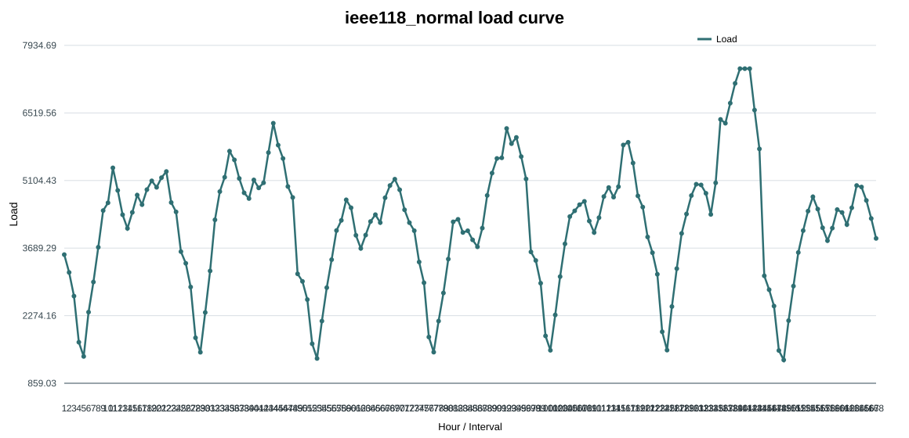
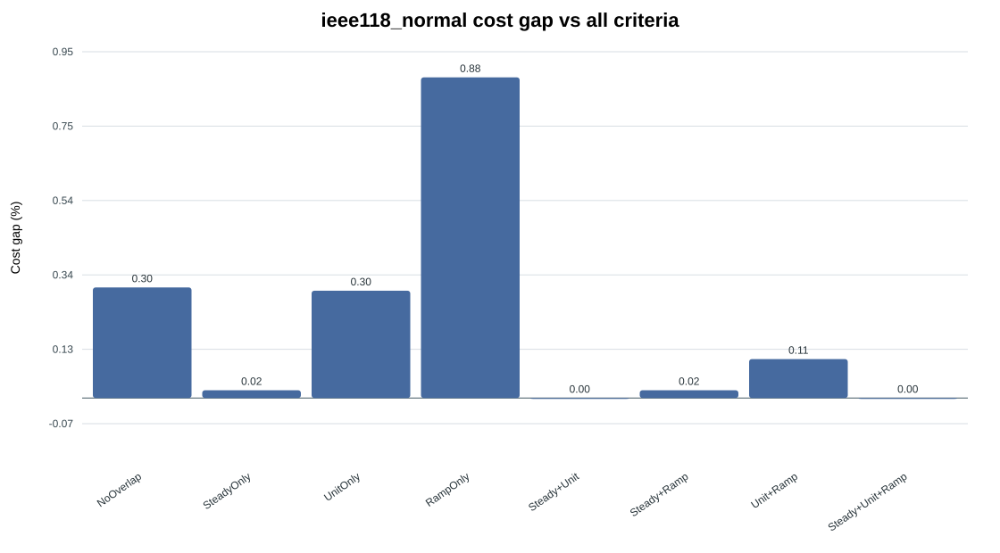
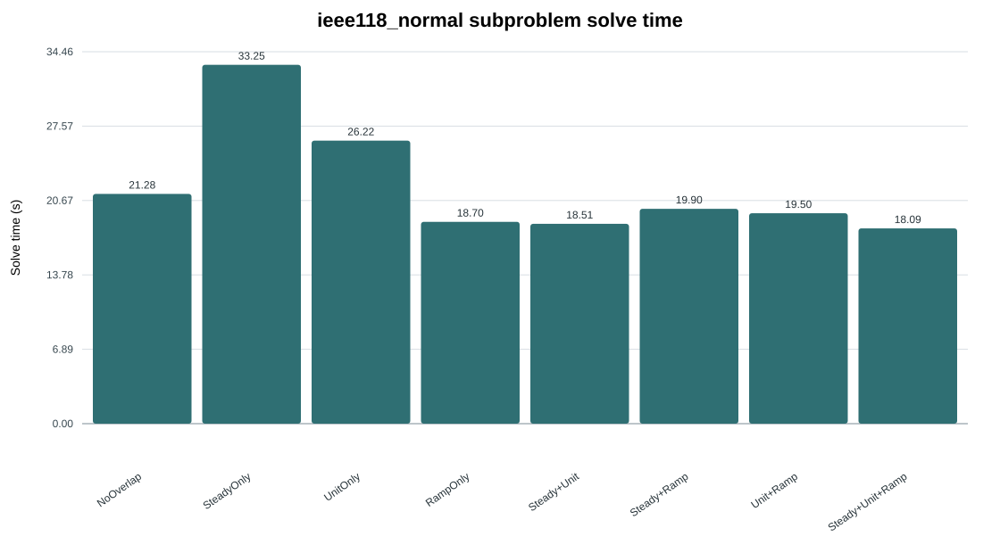
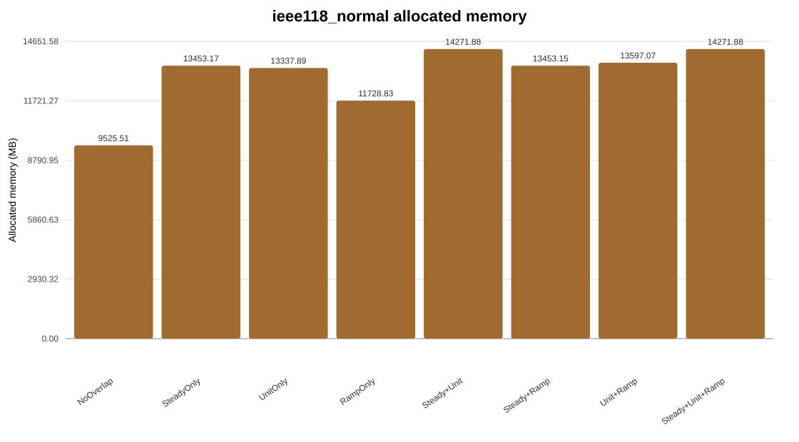
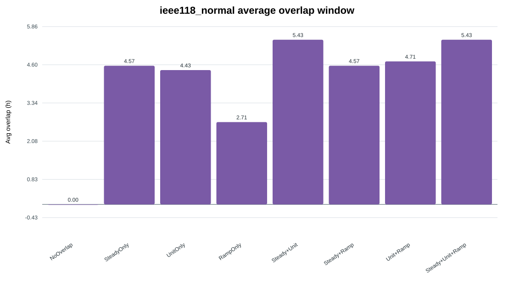
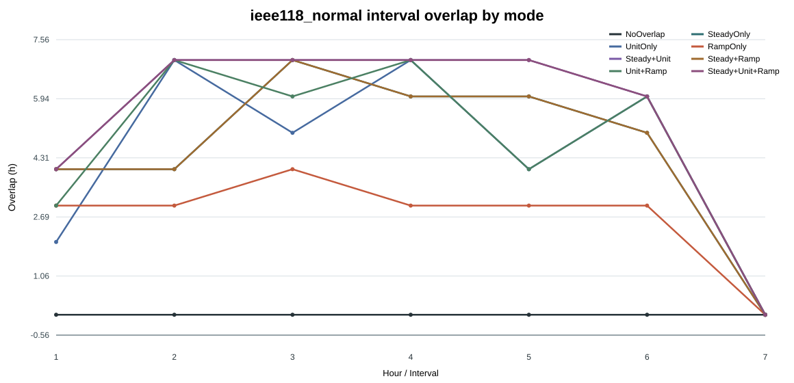

# Criteria Combination Detailed Report

- Scenario: `ieee118_normal`
- Generated: `2026-08-08 19:56:28`
- Training/calibration time is reported separately and excluded from operational simulation solve time.

## Performance Table

| Mode | Cost USD | Gap vs All % | Solve s | Memory MB | Avg overlap h | Load shedding | Wind curtailment |
|---|---:|---:|---:|---:|---:|---:|---:|
| NoOverlap | 14035802.80 | 0.3045 | 21.28 | 9525.51 | 0.00 | 6.46 | 1.50 |
| SteadyOnly | 13996181.38 | 0.0214 | 33.25 | 13453.17 | 4.57 | 6.46 | 0.57 |
| UnitOnly | 14034537.60 | 0.2955 | 26.22 | 13337.89 | 4.43 | 6.46 | 1.64 |
| RampOnly | 14116742.10 | 0.8830 | 18.70 | 11728.83 | 2.71 | 6.46 | 0.00 |
| Steady+Unit | 13993187.42 | 0.0000 | 18.51 | 14271.88 | 5.43 | 6.55 | 0.41 |
| Steady+Ramp | 13996181.38 | 0.0214 | 19.90 | 13453.15 | 4.57 | 6.46 | 0.57 |
| Unit+Ramp | 14008181.95 | 0.1072 | 19.50 | 13597.07 | 4.71 | 6.46 | 1.84 |
| Steady+Unit+Ramp | 13993187.42 | 0.0000 | 18.09 | 14271.88 | 5.43 | 6.55 | 0.41 |

## Charts

