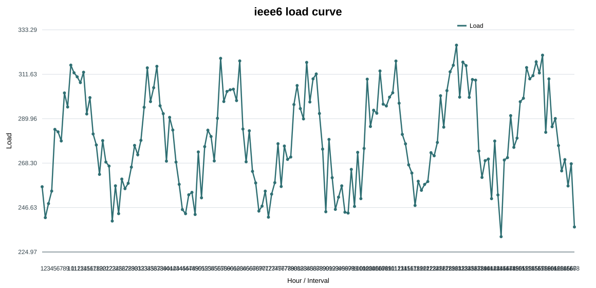
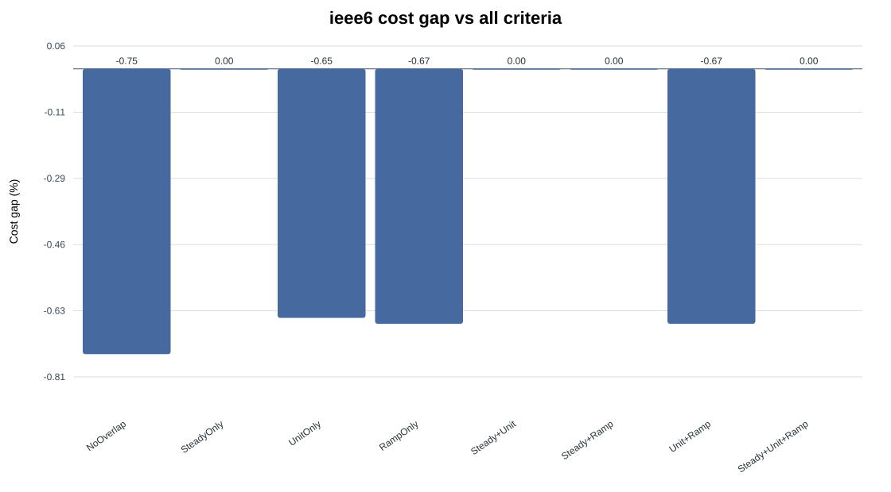
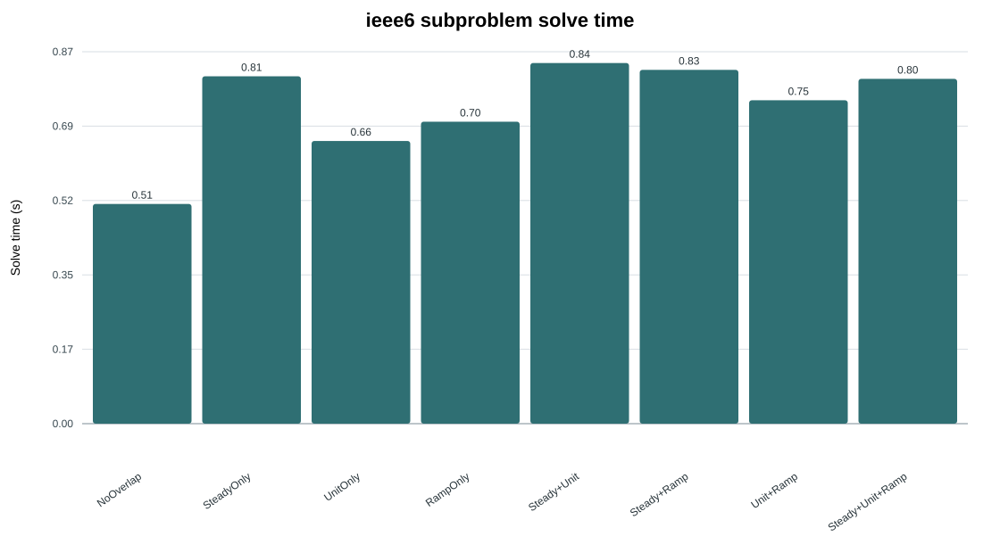
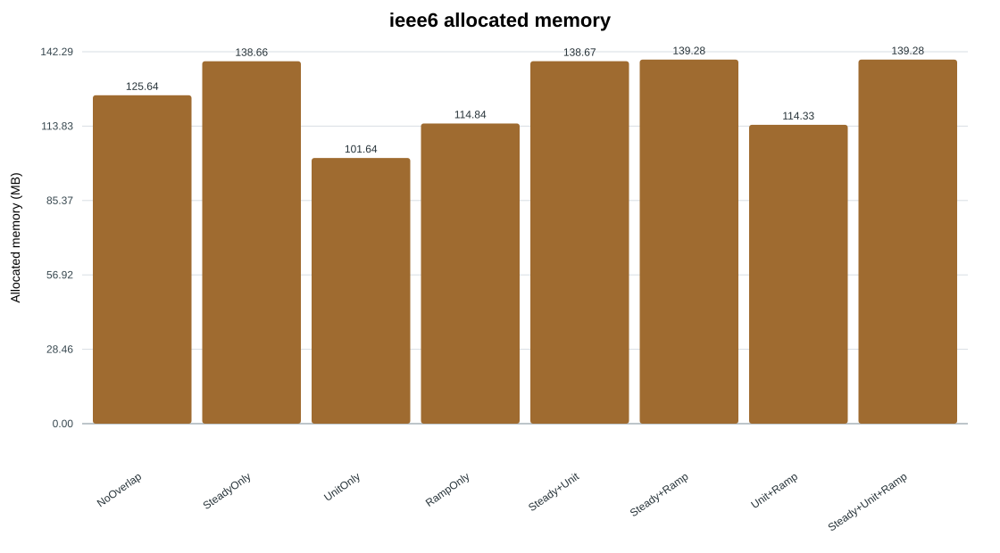
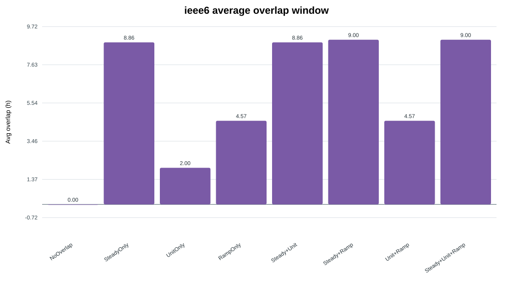
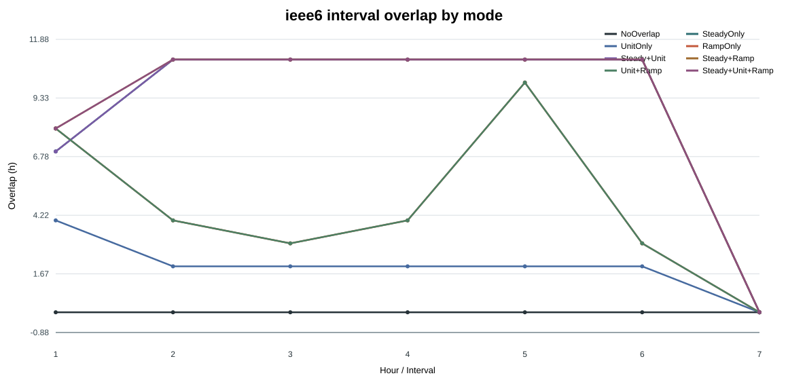

# Criteria Combination Detailed Report

- Scenario: `ieee6`
- Generated: `2026-08-08 21:15:12`
- Training/calibration time is reported separately and excluded from operational simulation solve time.

## Performance Table

| Mode | Cost USD | Gap vs All % | Solve s | Memory MB | Avg overlap h | Load shedding | Wind curtailment |
|---|---:|---:|---:|---:|---:|---:|---:|
| NoOverlap | 264103.20 | -0.7482 | 0.51 | 125.64 | 0.00 | 0.00 | 13.70 |
| SteadyOnly | 266094.17 | 0.0000 | 0.81 | 138.66 | 8.86 | 0.00 | 13.51 |
| UnitOnly | 264356.14 | -0.6532 | 0.66 | 101.64 | 2.00 | 0.00 | 13.56 |
| RampOnly | 264314.95 | -0.6686 | 0.70 | 114.84 | 4.57 | 0.00 | 13.55 |
| Steady+Unit | 266094.17 | 0.0000 | 0.84 | 138.67 | 8.86 | 0.00 | 13.51 |
| Steady+Ramp | 266094.17 | 0.0000 | 0.83 | 139.28 | 9.00 | 0.00 | 13.51 |
| Unit+Ramp | 264314.95 | -0.6686 | 0.75 | 114.33 | 4.57 | 0.00 | 13.55 |
| Steady+Unit+Ramp | 266094.17 | 0.0000 | 0.80 | 139.28 | 9.00 | 0.00 | 13.51 |

## Charts

